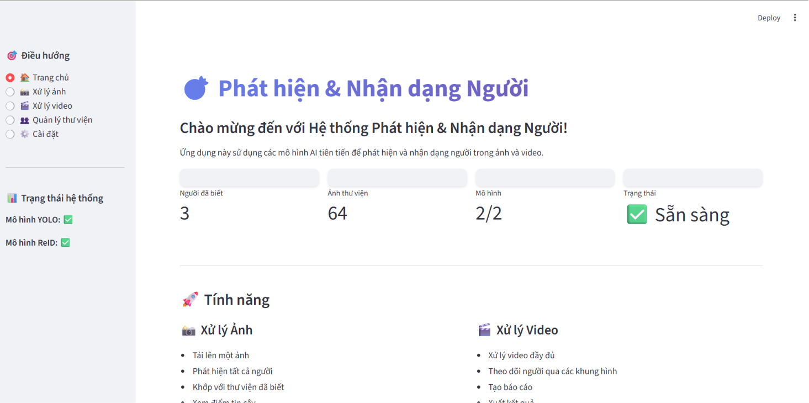
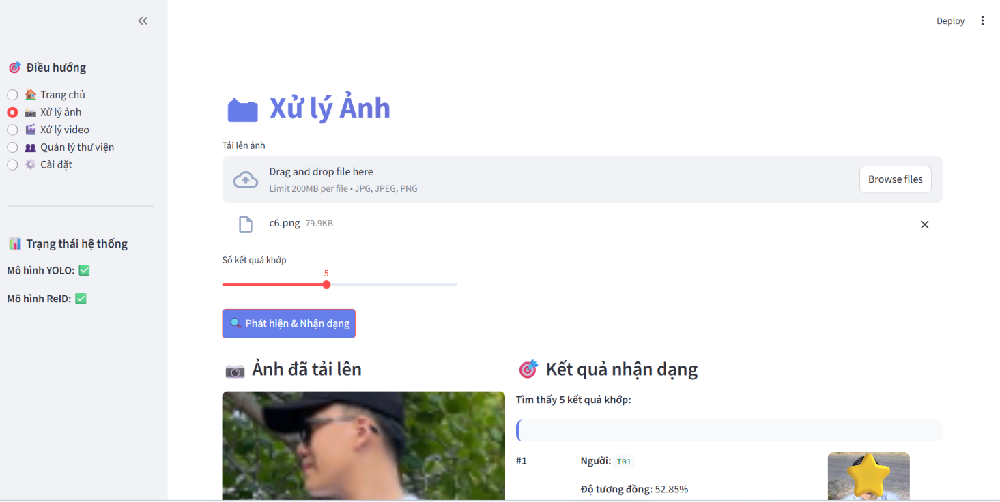
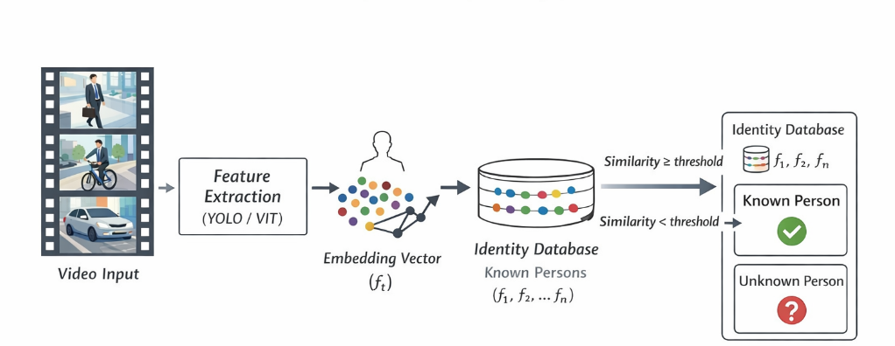

# DHT - Person Detection and Re-identification

This project provides a Streamlit interface for detecting, tracking, and re-identifying people in images and videos using YOLO and a ReID model.

## Frontend

### Home dashboard

The dashboard displays system readiness, gallery statistics, and the available image and video workflows.



### Image recognition

Upload an image, run detection and recognition, and review matching people with their similarity scores.



## Features

- Detect and track people in videos with YOLO.
- Match image and video crops against a local known-person gallery.
- Classify a person as known or unknown with an optional model.
- Build and manage gallery embeddings in the Streamlit UI.
- Save selected track crops in `result_frame/`.

## System flow

The diagram below summarizes the system workflow from input processing to person matching and result presentation.



## Project structure

```text
streamlit_app.py          # Streamlit user interface
src/core/common.py        # Shared model and image utilities
src/pipeline/service.py   # Detection, tracking, and ReID pipeline
scripts/                  # Maintenance and validation scripts
known_gallery/            # Known-person images and embeddings
models/                   # Local model weights
```

## Setup

1. Create and activate a Python virtual environment.
2. Install dependencies:

   ```bash
   pip install -r requirements.txt
   ```

3. Add the required model files to `models/`:
   - `yolov8_person_detection.pt`
   - `best_model_state_dict.pth`
   - `classification.pth` (optional, for classification mode)
4. Start the interface:

   ```bash
   streamlit run streamlit_app.py
   ```

Open `http://localhost:8501` in your browser.

## Gallery workflow

1. Open **Manage Gallery** in the Streamlit sidebar.
2. Add images under `known_gallery/<person_id>/` or upload them in the UI.
3. Select **Build Gallery** to generate `known_gallery/gallery_embeddings.npz`.
4. Use **Process Image** or **Process Video** to find matches.
